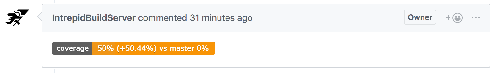

# Adding Coverage Status Reporting to Pull Requests

We can use the [GitHub Pull Request Coverage Status Plugin](https://github.com/jenkinsci/github-pr-coverage-status-plugin) to get test coverage measurements posted to GitHub as PR comments. The Skeleton projects and Jenkins templates have been updated with this setup, but these instructions can help legacy projects make use of this as well.

### Steps

1. If not a Skeleton-based project, set up [coverage reporting](android_cobertura.md)
1. Update `coverage.gradle` so that your jacoco reports output a file called `jacoco.xml`. Previously, it likely was `coverage.xml`.
    1. Make sure to also update your jenkins job to reference the correct file in the shell command where it converts JaCoCo reports to Cobertura format, if necessary
1. Add the "Record Master Coverage" post-build step to your main project job.
1. Make sure your PR builder job runs `unitTestCoverage` rather than `testDebugUnitTest`. 
1. Add the "Public coverage to GitHub" post-build step to your PR builder job. 

### Known issues

- The PR message will report 0% coverage on master, so you can't actually see the change in coverage. This seems to be due to one of [these](https://github.com/jenkinsci/github-pr-coverage-status-plugin/issues/28) [two](https://github.com/jenkinsci/github-pr-coverage-status-plugin/issues/20) issues in the plugin.
