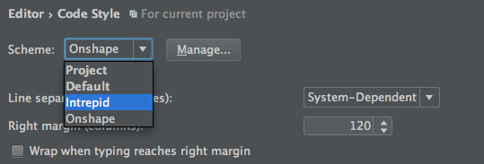

# Adding a Shared Code Style to Android Studio

You'll find the Intrepid code style template in this directory, it's
called "Intrepid.xml".

1. Download the code style file.
1. Import the code style by going to Preferences -> Editor -> Code Style and choosing "Import Scheme..." from the gear menu next to the "Scheme" box.
1. Select the file you downloaded in step 1.

You should now see the code style visible in the Scheme dropdown, as shown:



Our code style is a living document - if you have suggested changes,
please bring them up on the #android Slack channel for discussion and
we'll go from there!

### Syncing the code style file
Code style settings can also be checked into git and have the changes
be automatically synced across team members.

1. Choose "Copy to Project..." from Preferences -> Editor -> Code Style -> gear menu next to the "Scheme" box.
1. Select "Project" as the Scheme (this may be automatic)
1. The code style should now be present in `.idea/codeStyles/Project.xml` and the configuration in `.idea/codeStyles/codeStyleConfig.xml` will indicate to use project settings.
1. Add those two files to Git and commit them.

Normally, we put the whole `.idea`
folder under gitignore. However, we can make an exception for the code
style files.  You can explitly exempt them from being ignored by doing something like this:
```
.idea/*
!.idea/codeStyles/*
```

Or you can force-add them:
```
git add -f .idea/codeStyles
```

Once tracked, Git will notice changes to the files in the future.

That's it!  Your coworkers will get the new code style the next time they pull.  You can validate it's working by checking that the Scheme is automagically set to "Project".
