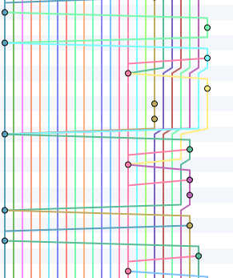

Atlassian has a couple of good articles covering [the conceptual differences of merging and rebasing](https://www.atlassian.com/git/tutorials/merging-vs-rebasing) and [the pros and cons of each workflow](https://www.atlassian.com/git/articles/git-team-workflows-merge-or-rebase/).

Why have we at Intrepid have chosen to prefer the rebase workflow?

We prefer to optimize our history for future developers rather than optimizing for ease of work in the moment and we find that the merge workflow does not allow that.

This merge history is much harder to understand

than this rebase history

