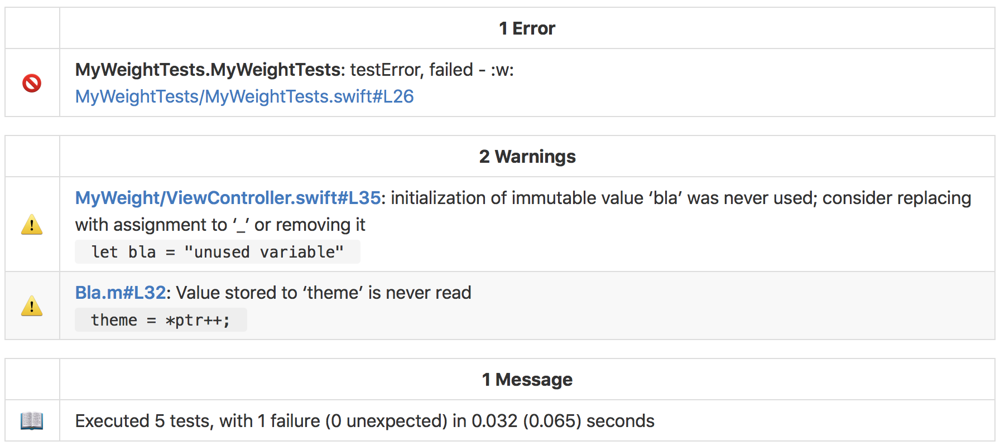

# Configure iOS Project To Use Danger For Build Reporting
These are the steps required to set up your iOS Jenkins project to report warnings, error, failed tests and more as a comment within your GitHub Pull Request. Currently, if your Jenkins build fails for any reason (failed test or build error), Jenkins will simply post into GitHub that the build failed without telling you why. A member of the project's team will then need to log into Jenkins, navigate to the Jenkins Pull Request project, and read through the console output for the cause of the build failure. Additionally, if a member of the team does not have access to Jenkins, they must request access and be provided it, which is not an instant process.

Therefore, to ease our Pull Request process, we are integrating [Danger](http://danger.systems) into our Jenkins projects. More specifically, we are using this Danger plugin called [Danger Xcode Summary](https://github.com/diogot/danger-xcode_summary). Usually, Danger would need to be added on a per-project basis, but we have a solution that only requires a single line modification to our [scan](https://github.com/fastlane/fastlane/tree/master/scan) command and the calling of a shell script, which can be found [here](https://github.com/IntrepidPursuits/Build-Scripts/blob/master/ios/danger.sh).

#### Example GitHub Danger Report


# Jenkins Setup
## Existing Projects Using Scan Inside An 'Execute Shell' Phase
Update the scan command to match the following:
```
# Run Tests on the project - Always using the Debug Configuration
scan --configuration "Debug" \
--skip_build true \
--code_coverage true \
--scheme "${XCODE_SCHEME}" \
--device "${TESTING_DEVICE}" \
--clean \                               // This \ needs to be added
--formatter 'xcpretty-json-formatter'   // New line to add
```

Then, as the last line in the 'Execute Shell' Phase, please add:
```
# Danger
${SCRIPT_DIR}/danger.sh
```
This line calls the script we have created to integrate Danger and run it to process our build results. For those who are interested, you can find the `danger.sh` script [here](https://github.com/IntrepidPursuits/Build-Scripts/blob/master/ios/danger.sh).

**NOTE:** If you have setup Danger within your own project already, the `danger.sh` script checks to see if certain lines exist within your Dangerfile and adds the missing commands if needed. There is no modification to your existing configuration; lines are added to integrate with the Danger Xcode Summary plugin mentioned above.

## Troubleshooting Issues With Danger
If for some reason there is an issue with danger and/or its integration, simply comment out the call to the danger script like so:
```
# ${SCRIPT_DIR}/danger.sh   // The # is comment for shells scripts
```
You do not need to modify/remove the `--formatter 'xcpretty-json-formatter'` line from the scan command so this formatter simply creates an additional files that is only used by danger and will not affect the build if the formatter is left here.

## Existing Projects Using Xcode Plugin
We have abandoned the Jenkins Xcode Plugin because it is no longer being maintained and does not allow for the level of customization we desire. Please update your Jenkins project to match the `ios-pull-request-template` found [here](https://ci.intrepid.io/view/Templates/job/ios-pull-request-template/).


## New Projects Being Set Up On Jenkins
Please clone the `ios-pull-request-template` found [here](https://ci.intrepid.io/view/Templates/job/ios-pull-request-template/) and make the changes stated in that project to work with your specific iOS project.

# Help
For any help setting this up, please reference the `ios-pull-request-template` Jenkins project or ask **David Brooks (dbrooks@intrepid.io)** for assistance.
