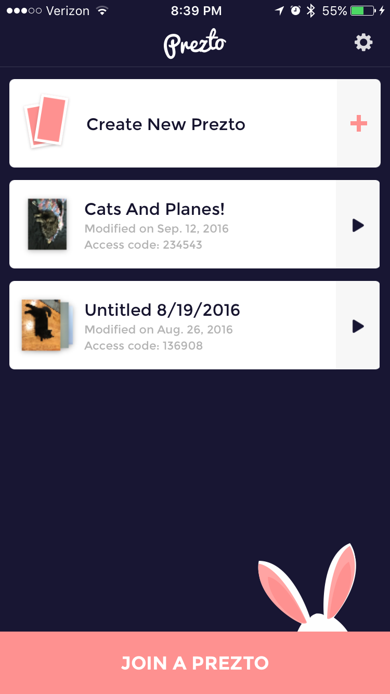

# View Model Example

This file lays out an example of view model use from the Prezto project.

Prezto is an app used to create and share slideshows (preztos) directly on your mobile device.

For this example, we show the implemenation of the "saved preztos" screen, which allows a user to:

- Create a new prezto
- View a list of existing prezto's
- Delete a prezto



NOTE: While this page does show code used in an actual project, the snippets here show only the relevant parts to illustrate view model use. The full versions of these files can be found here:

- [`SavedPreztosViewModel.swift`](https://github.com/IntrepidPursuits/prezto-ios/blob/kevin/saved-preztos/prezto-ios/Features/SavedPreztos/SavedPreztosViewModel.swift)
- [`SavedPreztoViewModel.swift`](https://github.com/IntrepidPursuits/prezto-ios/blob/kevin/saved-preztos/prezto-ios/Features/SavedPreztos/SavedPreztoViewModel.swift)
- [`SavedPreztosViewController.swift`](https://github.com/IntrepidPursuits/prezto-ios/blob/kevin/saved-preztos/prezto-ios/Features/SavedPreztos/SavedPreztosViewController.swift)
- [`SavedPreztoTableViewCell.swift`](https://github.com/IntrepidPursuits/prezto-ios/blob/kevin/saved-preztos/prezto-ios/Features/SavedPreztos/SavedPreztoTableViewCell.swift)

## Parent View Model

The `SavedPreztosViewController` contains a `SavedPreztosViewModel` that provides the backing logic for fetching and deleting prezto's. 

The relevant portion is shown below:

### SavedPreztosViewController.swift
```swift
class SavedPreztosViewModel {

    var savedPreztos = [Prezto]() 

    var count: Int {
        return savedPreztos.count
    }

    func retrievePreztos(completion: (RequestResult<[Prezto]>) -> ()) {
        RequestManager.sharedInstance.getMyPreztos { result in
            switch result {
            case .Success(let preztos):
                self.savedPreztos = preztos
            case .Failure(let error):
                print("Error refreshing preztos: \(error)")
                return
            }
            completion(result)
        }
    }

    func getPrezto(index: Int) -> Prezto {
        return savedPreztos[index]
    }

    func deletePreztoAtIndex(index: Int, completion: (RequestResult<Void>) -> ()) {
        guard index < savedPreztos.count else {
            completion(.Failure("No prezto found to delete."))
            return
        }
        let prezto = savedPreztos[index]
        guard let id = prezto.id else {
            completion(.Failure("No id found on prezto."))
            return
        }

        RequestManager.sharedInstance.deletePrezto(id) { result in
            self.savedPreztos.removeAtIndex(index)
            completion(.Success())
        }
    }
}
```

## Child View Models

This `SavedPreztosViewModel` also contains an array of `SavedPreztoViewModel` objects that are used in displaying information about an individual prezto.

### SavedPreztosViewController.swift
```swift
class SavedPreztosViewModel {

    var savedPreztos = [Prezto]() {
        didSet {
            viewModels = [SavedPreztoViewModel?](count: savedPreztos.count, repeatedValue: nil)
        }
    }

    var viewModels = [SavedPreztoViewModel?]()

    func viewModelForPreztoAtIndex(index: Int) -> SavedPreztoViewModel {
        if let viewModel = viewModels[index] {
            return viewModel
        } else {
            let viewModel = SavedPreztoViewModel(prezto: savedPreztos[index])
            viewModels[index] = viewModel
            return viewModel
        }
    }
}
```

The `SavedPreztoViewModel` encapsulates view styling logic for individual cells, as well as the logic to download thumbnail images.

### SavedPreztoViewModel.swift

```swift
class SavedPreztoViewModel {

    let prezto: Prezto
    var images: [UIImage]?

    init(prezto: Prezto) {
        self.prezto = prezto
    }

    var titleLabelText: String {
        return prezto.title ?? ""
    }

    var accessCodeLabelText: String {
        guard let code = prezto.accessCode else {
            return ""
        }
        return "Access code: \(code)"
    }

    var modifiedLabelText: String {
        guard let updatedAt = prezto.updatedAt else {
            return ""
        }
        return "Modified on \(updatedAt.dateInLocalTimeZone())"
    }

    func getImages(completion: () -> Void) {
        if let _ = images {
            completion()
        } else {
            prezto.thumbnailImages { images in
                self.images = images
                completion()
            }
        }
    }
```

## Using the view models

Below is a stripped-down version of `SavedPreztosViewController` showing the relevant places where the view models are used:

### SavedPreztosViewController.swift

```swift
class SavedPreztosViewController: UIViewController, UITableViewDataSource, UITableViewDelegate, UIScrollViewDelegate, SWTableViewCellDelegate {
    
    @IBOutlet weak var tableView: UITableView!

    let viewModel = SavedPreztosViewModel()

    /********************************************************************
     * Skipping a bunch of view controller setup and life-cycle code... *
     ********************************************************************/

    override func didReceiveMemoryWarning() {
        super.didReceiveMemoryWarning()

        viewModel.clearCachedImages()
    }
    
    /****************************************
     * Skipping a bunch of UI setup code... *
     ****************************************/

    private func refreshSavedPreztosList() {
        viewModel.retrievePreztos { result in
            switch result {
            case .Success:
                dispatch_async(dispatch_get_main_queue()) {
                    self.tableView.reloadData()
                    self.setupBunnyImage()
                }
            case .Failure(let error):
                // TODO: Need UI here to retry
                print("Error refreshing preztos: \(error)")
                return
            }
        }
    }

    private func deletePreztoAtIndex(index: Int) {
        viewModel.deletePreztoAtIndex(index) { result in
            dispatch_async(dispatch_get_main_queue()) {
                switch result {
                case .Success:
                    if self.viewModel.count == 0 {
                        self.goToEmptyVC()
                    } else {
                        self.tableView.reloadData()
                        self.setupBunnyImage()
                    }
                case .Failure(let e):
                    print("Error deleting prezto: \(e)")
                    self.presentAlertWithTitle("Error", message: "There was an unexpected problem deleting a Prezto.")
                }
            }
        }
    }

    /*****************************************
     * Skipping a bunch of helper methods... *
     *****************************************/

    // MARK: - UITableViewDataSource
    
    func numberOfSectionsInTableView(tableView: UITableView) -> Int {
        return viewModel.count + 1
    }
    
    func tableView(tableView: UITableView, numberOfRowsInSection section: Int) -> Int {
        return 1
    }
    
    func tableView(tableView: UITableView, heightForHeaderInSection section: Int) -> CGFloat {
        return 12.0
    }
    
    func tableView(tableView: UITableView, heightForFooterInSection section: Int) -> CGFloat {
        return section == viewModel.count ? 12 : 0
    }
    
    // Snip...
    
    func tableView(tableView: UITableView, cellForRowAtIndexPath indexPath: NSIndexPath) -> UITableViewCell {
        if indexPath.section == 0 {
            if let createPreztoCell = tableView.dequeueReusableCellWithIdentifier(SavedPreztosViewController.CreateNewPreztoTVCIdentifier, forIndexPath: indexPath) as? CreateNewPreztoTableViewCell {
                createPreztoCell.layer.cornerRadius = 5
                return createPreztoCell
            }
        } else if let savedPreztoCell = tableView.dequeueReusableCellWithIdentifier(SavedPreztosViewController.SavedPreztoTVCIdentifier, forIndexPath: indexPath) as? SavedPreztoTableViewCell {
            let index = indexPath.section - 1

            savedPreztoCell.delegateVC = self
            savedPreztoCell.viewModel = viewModel.viewModelForPreztoAtIndex(index)
            savedPreztoCell.setRightUtilityButtons(createDeleteBtn(), withButtonWidth: 42.0)
            savedPreztoCell.layer.cornerRadius = 5

            savedPreztoCell.delegate = self
            return savedPreztoCell
        }
        return UITableViewCell()
    }
    
}
```

Finally, here is the relevant portion of `SavedPreztoTableViewCell`:

### SavedPreztoTableViewCell
```swift
class SavedPreztoTableViewCell: SWTableViewCell {

    var viewModel: SavedPreztoViewModel? {
        didSet {
            guard let viewModel = viewModel else { return }

            viewModel.getImages { images in
                // Make sure that our view model hasn't been swapped out for a different one
                guard let currentViewModel = self.viewModel where
                    viewModel.prezto.id == currentViewModel.prezto.id else {
                    return
                }
                self.setupThumbnailView()
            }

            titleLabel.text = viewModel.titleLabelText
            accessCodeLabel.text = viewModel.accessCodeLabelText
            modifiedOnLabel.text = viewModel.modifiedLabelText
        }
    }
```
