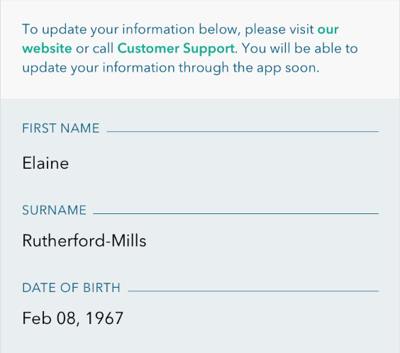

# View Model Reuse

Sometimes a view might be generic enough that it would need to be repurposed for multiple models. The most compelling use case is for a table view cells that are generic enough that they are used in multiple different places:

###ProfileViewController


###ReviewViewController


The view models for these controllers are called ProfileViewModel and ReviewViewModel respectively.

The table view cell pictured here is the same in both cases, and we would ideally like to reuse the table view cell and it's xib. In both cases, we are trying to abstract view logic out of the table view cell. However, the models that drive these two cells are very different. Let's explore two approaches of view models that can be used for this view.

### Concrete view model class

This simpler of the two approaches just has a concrete class for the view, which is how we would do it if the cell only had to display one kind of model.

```swift

struct TitleMessageCellViewModel {
  let title: String
  let message: String
  let showsEditButton = false
}

class TitleMessageCell: UITableViewCell {
  @IBOutlet private weak var titleLabel: UILabel!
  @IBOutlet private weak var messageLabel: UILabel!

  private func configure(viewModel: TitleMessageCellViewModel) {
    titleLabel.text = viewModel.title.uppercaseString
    messageLabel.text = viewModel.message
    editButton.hidden = !viewModel.showsEditButton
  }
}

```

An implementation for ProfileViewModel might look like this:

```swift

// ProfileViewModel.swift

var firstName: String
var lastName: String

func viewModel(forIndex index: Int) -> TitleMessageCellViewModel {
  switch index {
    case 0:
      return TitleMessageCellViewModel(title: "First Name", message: firstName)
    case 1:
      return TitleMessageCellViewModel(title: "Surname", message: lastName)
    ...
  }
}

```

This implementation abstracts out the view logic details out of the table view cell, and into ProfileViewModel. When the view logic is trivial, this is not too bad.

The implementation for ReviewViewModel, however, might look like this:

```swift

// ReviewViewModel.swift

var profile: Profile
var topics: [Topics]

func viewModel(forIndex index: Int) -> TitleMessageCellViewModel {
  switch index {
    case 0:
      let formatter = PhoneNumberFormatter(forCountryCode: currentCountryCode)
      let number = formatter.formatNumber(profile.phoneNumber) ?? "-"
      return TitleMessageCellViewModel(title: "Contact number", message: number, showsEditButton: profile.canEdit)
    case 1:
      let rows = topics.filter({ $0.selected }).map({ $0.title }).joinWithSeparator("\n")
      return TitleMessageCellViewModel(title: "Visit Details", message: topics, showsEditButton: review.canEdit)
    ...
  }
}

```

The problem with this approach is that when the view logic is trivial (ProfileViewModel), we can get away with implementing view logic in the parent view model, but as soon as it gets complicated(ReviewViewModel), the view model starts knowing a lot about the individual cell logic details, and we are back into a situation with bloat.


### Protocol based view model

We can use protocols to standardize the interface for the view, while keeping implementation details abstracted out into it's own entity.

```swift

protocol TitleMessageCellConforming {
  let title: String { get }
  let message: String { get }
  let showsEditButton: Bool { get }
}

```

Note that the only difference between the protocol and the concrete implementation of this class is that one is a protocol and the other is a class. With this, we can delegate the deatils of supplying the title, message, and whether or not to show an edit button to a different class.

```swift

// PhoneNumberTitleMessageCellViewModel.swift
struct PhoneNumberTitleMessageCellViewModel: TitleMessageCellConforming {
  let title: String
  let message: String
  let showsEditButton: Bool

  init(profile: Profile) {
    let formatter = PhoneNumberFormatter(forCountryCode: currentCountryCode)
    let number = formatter.formatNumber(profile.phoneNumber) ?? "-"
    title = "Contact number"
    message = number
    showsEditButton = profile.canEdit
  }

// TopicsTitleMessageCellViewModel.swift
struct TopicsTitleMessageCellViewModel: TitleMessageCellConforming {
  let title: String
  let message: String
  let showsEditButton: Bool

  init(topics: [Topics], review: Review) {
    title = "Visit Details"
    message = topics.filter({ $0.selected }).map({ $0.title }).joinWithSeparator("\n")
    showsEditButton = review.canEdit
  }
}

```

This moves view logic code into separate view models:

```swift

// ReviewViewModel.swift
func viewModel(forIndex index: Int) -> TitleMessageCellConforming {
  switch index {
    case 0:
      return PhoneNumberTitleMessageCellViewModel(profile)
    case 1:
      return AllergiesTitleMessageCellViewModel(allergies, review: review)

    ...
  }
}

```

For the profile, it might still be okay to leave the view model logic in ProfileViewModel, due to it's simplicity.

```swift

// TitleMessageCellViewModel.swift

struct TitleMessageCellViewModel: TitleMessageCellConforming {
  let title: String
  let message: String
  let showsEditButton: Bool
  
  init(title: String, message: String) {
    self.title = title
    self.message = message
  }
}

// ProfileViewModel.swift
func viewModel(forIndex index: Int) -> TitleMessageCellConforming {
  switch index {
    case 0:
      return TitleMessageCellViewModel(title: "First Name", message: profile.firstName) // Now, TitleMessageCellViewModel is simply a struct that implements TitleMessageCellConforming.
    case 1:
      return TitleMessageCellViewModel(title: "Surname", message: profile.lastName)
    ...
  }
}

```

## Conclusions and takeaways

View models are a tool to facilitate view logic abstraction, but also code reuse. A protocol-based approach allow us to take abstraction one level further, so that our view relies on a generic interface, without forcing an implementation. The responsibility for implementation can now be handled by specific entities(TopicsTitleMessageCellViewModel, PhoneNumberTitleMessageCellViewModel).

This approach still allows us to populate a simple table view cells without creating additional classes that conform to the view model protocol. In ProfileViewModel, the cells are simple enough that all of the view formatting takes place in that class itself.
