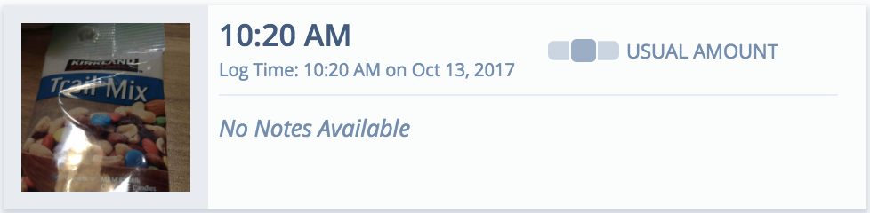
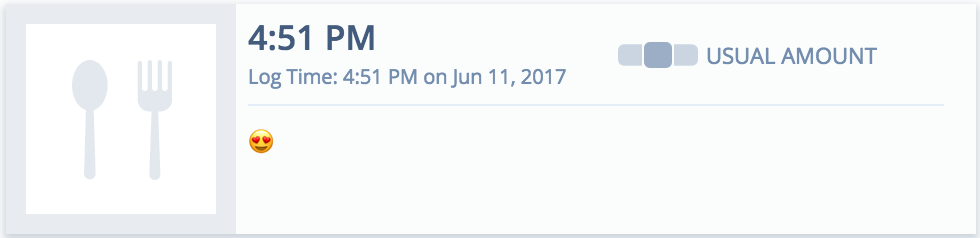
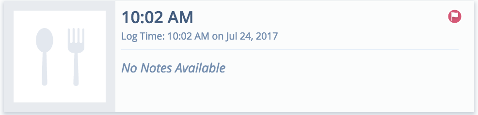

# React Testing

## General Guidelines
* Use Jest for testing.
* Use [enzyme](https://github.com/airbnb/enzyme). Furthermore, prefer using [shallow rendering](https://github.com/airbnb/enzyme/blob/master/docs/api/shallow.md).

## Redux Testing
Redux is comprised of regular JavaScript functions, so testing them is nothing special. Regardless, the following are some guidelines that will help when writing tests.

### Action Creators
Test that when the action creator is invoked with its arguments (if any) it produces an action with the correct type and payload (if it has one).

### Reducers
Test that given an initial state and a given action it produces the correct next state. It's a good idea to add an assertion that the next state object is not the same as the initial object using the `toBe` Jest matcher.

### Selectors
Test that the selector returns the desired data from the state given the state and props (if given).

## Component Testing

### Testing Stateless Functional Components
Let's say we are testing a `MealEvent` component which may have, but is not limited to, the following states:





The implementation is as follows:

*index.js*

```js
import React, { PropTypes } from "react";
import styles from "./styles.module.scss";
import IconFlag from "components/UI/IconFlag";
import Portion from "components/UI/Portion";
import enhance from "./enhance";

export const text = {
  altMeal: "meal event image"
};

export const MealEvent = ({
  dateTimeText,
  flagged,
  mealEventImgOnError,
  noteText,
  onClick,
  portion,
  srcMealEvent,
  stylesImage,
  stylesNoteText,
  testMeal,
  timeText
}) => (
  <div className={styles.container} onClick={onClick}>
    <div className={styles.containerFlag}>{flagged && <IconFlag large />}</div>
    <div className={styles.containerMealEventImage}>
      
    </div>
    <div className={styles.rightSection}>
      <div className={styles.rightSectionTopHalf}>
        <div className={styles.timeSection}>
          <span className={styles.timeText}>{timeText}</span>
          <span className={styles.dateTimeText}>{dateTimeText}</span>
        </div>
        {testMeal || (
          <div className={styles.portionSection}>
            <Portion portion={portion} />
          </div>
        )}
      </div>
      <div className={styles.noteSection}>
        <span className={stylesNoteText}>{noteText}</span>
      </div>
    </div>
  </div>
);

MealEvent.propTypes = {
  dateTimeText: PropTypes.string.isRequired,
  flagged: PropTypes.bool.isRequired,
  mealEventImgOnError: PropTypes.func.isRequired,
  noteText: PropTypes.string.isRequired,
  portion: PropTypes.string,
  srcMealEvent: PropTypes.string.isRequired,
  stylesImage: PropTypes.string.isRequired,
  stylesNoteText: PropTypes.string.isRequired,
  testMeal: PropTypes.bool.isRequired,
  timeText: PropTypes.string.isRequired
};

export default enhance(MealEvent);
```

You want to write tests that assert that the following are rendered if applicable:

* Text
* Event Handlers
* Styles
* Image Tags
* Components

These may be present, absent, or change dynamically based on the given props. Here is an example test file:

*__tests__/index.js*

```js
import React from "react";
import { shallow } from "enzyme";
import { MealEvent, text } from "../index";
import styles from "../styles.module.scss";
import IconFlag from "components/UI/IconFlag";
import Portion from "components/UI/Portion";

describe("MealEvent", () => {
  let props, wrapper;

  beforeEach(() => {
    props = {
      dateTimeText: "9:37 AM",
      flagged: true,
      mealEventImgOnError: jest.fn(),
      noteText: "I am a note",
      onClick: jest.fn(),
      portion: "Regular",
      srcMealEvent: "http://via.placeholder.com/350x150",
      stylesImage: "imageMealEvent",
      stylesNoteText: "noteTextAbsent",
      testMeal: false,
      timeText: "Log Time: 10:39 AM on Jun 1, 2017"
    };
    wrapper = shallow(<MealEvent {...props} />);
  });

  it("renders dateTimeText", () => {
    expect(wrapper).toIncludeText(props.dateTimeText);
  });

  it("renders noteText", () => {
    expect(wrapper).toIncludeText(props.noteText);
  });

  it("renders timeText", () => {
    expect(wrapper).toIncludeText(props.timeText);
  });

  it("handles click events", () => {
    wrapper.simulate("click");

    expect(props.onClick).toHaveBeenCalled();
  });

  it("renders a span with className of stylesNoteText", () => {
    const element = wrapper
      .find("span")
      .filterWhere(n => n.props().className === props.stylesNoteText);

    expect(element).toBePresent();
  });

  it("renders img whose src is srcMealEvent and calls the correct error function", () => {
    const element = wrapper.find("img").filterWhere(n => {
      const { alt, className, src, onError } = n.props();
      return (
        className === props.stylesImage &&
        src === props.srcMealEvent &&
        onError === props.mealEventImgOnError &&
        alt === text.altMeal
      );
    });

    expect(element).toBePresent();

    element.simulate("error");

    expect(props.mealEventImgOnError).toHaveBeenCalled();
  });

  it("does not render an img whose src is srcPortion if testMeal is true", () => {
    wrapper.setProps({ ...props, testMeal: true });
    const element = wrapper
      .find("img")
      .filterWhere(n => n.props().src === props.srcPortion);

    expect(element).not.toBePresent();
  });

  it("renders IconFlag if flagged prop is true", () => {
    const element = wrapper.find(IconFlag);

    expect(element).toBePresent();
  });

  it("does not render IconFlag if flagged prop is false", () => {
    wrapper.setProps({ ...props, flagged: false });
    const element = wrapper.find(IconFlag);

    expect(element).not.toBePresent();
  });

  it("renders Portion if test meal false", () => {
    const element = wrapper.find(Portion);

    expect(element).toBePresent();

    const { portion } = element.props();

    expect(portion).toBe(props.portion);
  });

  it("does not render Portion if test meal true", () => {
    wrapper.setProps({ ...props, testMeal: true });
    const element = wrapper.find(Portion);

    expect(element).not.toBePresent();
  });
});
```

### Testing enhance Higher-Order Component (HOC)

Testing enhance files is easy. Simply export all the prop creators functions and test them like you would test a normal function. Here is an `enhance` file for the previous component:

*enhance.js*

```js
import moment from "moment-timezone";
import { connect } from "react-redux";
import { compose, flattenProp, withState } from "recompose";
import addProps from "utilities/addProps";
import { mealEvent } from "utilities/selectors";
import srcMealDefault from "./mealDefault.svg";
import styles from "./styles.module.scss";

const mapStateToProps = (state, props) => ({
  mealEvent: mealEvent(state, props)
});

export const setInitialImageUrl = ({ imageUrl }) => imageUrl;

const dateTimeFormat = "h:mm A on MMM D, YYYY";
export const dateTimeText = ({ consumedAt }) =>
  `Log Time: ${moment(consumedAt).format(dateTimeFormat)}`;

export const flagged = ({ flaggedAt }) => Boolean(flaggedAt);

export const mealEventImgOnError = ({ setImageUrl }) => () => setImageUrl(null);

export const defaultNoteText = "No Notes Available";
export const noteText = ({ notes }) => (notes ? notes : defaultNoteText);

export const srcMealEvent = ({ imageUrl }) =>
  imageUrl ? imageUrl : srcMealDefault;

export const stylesImage = ({ imageUrl, imageOrientation }) =>
  imageUrl && imageOrientation === "Rotate 90 CW"
    ? styles.imageMealEventRotated
    : styles.imageMealEvent;

export const styleNoteTextAbsent = "noteTextAbsent";
export const styleNoteTextPresent = "noteTextPresent";
export const stylesNoteText = ({ notes }) =>
  notes ? styleNoteTextPresent : styleNoteTextAbsent;

const timeFormat = "h:mm A";
export const timeText = ({ consumedAt }) =>
  moment(consumedAt).format(timeFormat);

export default compose(
  connect(mapStateToProps),
  flattenProp("mealEvent"),
  withState("imageUrl", "setImageUrl", setInitialImageUrl),
  addProps({
    dateTimeText,
    flagged,
    mealEventImgOnError,
    noteText,
    srcMealEvent,
    stylesImage,
    stylesNoteText,
    timeText
  })
);
```

And here are the associated tests for it:

```js
import {
  dateTimeText,
  flagged,
  defaultNoteText,
  mealEventImgOnError,
  noteText,
  setInitialImageUrl,
  srcMealEvent,
  styleNoteTextAbsent,
  styleNoteTextPresent,
  styleNoteText,
  stylesImage,
  timeText,
} from '../enhance';
import srcMealDefault from '../mealDefault.svg';
import styles from '../styles.module.scss';

describe('dateTimeText', () => {
  it('returns formatted full date with time', () => {
    const result = dateTimeText({ consumedAt: '2017-05-08T16:00:19.433000Z' });

    expect(result).toBe('Log Time: 12:00 PM on May 8, 2017');
  });
});

describe('flagged', () => {
  it('returns true if a date is given', () => {
    const result = flagged({ flaggedAt: '2017-05-08T16:00:19.433000Z' });

    expect(result).toBe(true);
  });

  it('returns false if a date is not given', () => {
    const result = flagged({ flaggedAt: null });

    expect(result).toBe(false);
  });
});

describe('mealEventImgOnError', () => {
  it('returns a function that calls setImageUrl with null', () => {
    const setImageUrl = jest.fn();
    const func = mealEventImgOnError({ setImageUrl });

    func();

    expect(setImageUrl).toHaveBeenCalledWith(null);
  });
});

describe('noteText', () => {
  it('returns notes if given', () => {
    const notes = 'Hi mom';
    const result = noteText({ notes });

    expect(result).toBe(notes);
  });

  it('returns defaultNoteText if nothing given', () => {
    const result = noteText({ notes: null });

    expect(result).toBe(defaultNoteText);
  });
});

describe('srcMealEvent', () => {
  it('returns the imageUrl if given', () => {
    const imageUrl = 'http://meow.com/cat.jpg';
    const result = srcMealEvent({ imageUrl });

    expect(result).toBe(imageUrl);
  });

  it('returns the srcMealDefault if nothing given', () => {
    const result = srcMealEvent({ imageUrl: null });

    expect(result).toBe(srcMealDefault);
  });
});

describe('stylesImage', () => {
  it('returns styles.imageMealEventRotated if imageUrl is present and imageOrientation is Rotate 90 CW', () => {
    const result = stylesImage({
      imageUrl: 'http://meow.com/cat.jpg',
      imageOrientation: 'Rotate 90 CW',
    });

    expect(result).toBe(styles.imageMealEventRotated);
  });

  it('returns styles.imageMealEvent if imageUrl is present and imageOrientation is not Rotate 90 CW', () => {
    const result = stylesImage({
      imageUrl: 'http://meow.com/cat.jpg',
      imageOrientation: 'Horizontal (normal)',
    });

    expect(result).toBe(styles.imageMealEvent);
  });

  it('returns styles.imageMealEvent if imageUrl is not present', () => {
    const result = stylesImage({ imageUrl: null, imageOrientation: null });

    expect(result).toBe(styles.imageMealEvent);
  });
});

describe('styleNoteText', () => {
  it('returns styleNoteTextPresent if given', () => {
    const notes = 'Hi mom';
    const result = styleNoteText({ notes });

    expect(result).toBe(styleNoteTextPresent);
  });

  it('returns styleNoteTextAbsent if not given', () => {
    const result = styleNoteText({ notes: null });

    expect(result).toBe(styleNoteTextAbsent);
  });
});

describe('timeText', () => {
  it('returns formatted time', () => {
    const result = timeText({ consumedAt: '2017-05-08T16:00:19.433000Z' });

    expect(result).toBe('12:00 PM');
  });
});

describe('setInitialImageUrl', () => {
  it('returns imageUrl', () => {
    const imageUrl = 'http://placehold.it/25x25';
    const result = setInitialImageUrl({ imageUrl });
    expect(result).toBe(imageUrl);
  });
});
```
